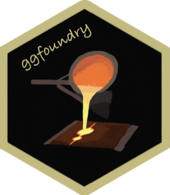

<!-- README.md is generated from README.Rmd. Please edit that file -->

```{r, include = FALSE}
knitr::opts_chunk$set(
  collapse = TRUE,
  comment = "#>",
  fig.path = "man/figures/README-",
  out.width = "100%"
)
```

# ggfoundry <a href="https://cgoo4.github.io/ggfoundry/"></a>

<!-- badges: start -->
[](https://lifecycle.r-lib.org/articles/stages.html#experimental)
[](https://app.codecov.io/gh/cgoo4/ggfoundry?branch=main)
[](https://github.com/cgoo4/ggfoundry/actions/workflows/R-CMD-check.yaml)
<!-- badges: end -->

Arbitrary hand-crafted fillable shapes for ggplot2.

New shapes may be feature requested via a Github issue.

## Installation

Install the development version of ggfoundry from [GitHub](https://github.com/):

``` r
# install.packages("pak")
pak::pak("cgoo4/ggfoundry")
```

## Basic example

See [get started](https://cgoo4.github.io/ggfoundry/) for more details.

```{r example, fig.retina=3}
library(ggfoundry)

ggplot(mtcars, aes(wt, mpg, fill = factor(cyl))) +
  geom_casting(aes(shape = factor(cyl))) +
  scale_fill_manual(values = c("skyblue", "lightgreen", "pink")) +
  scale_shape_manual(values = c("violin", "dendro", "box")) +
  theme_bw()
```

