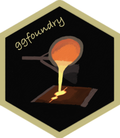

<!-- README.md is generated from README.Rmd. Please edit that file -->

```{r, include = FALSE}
knitr::opts_chunk$set(
  collapse = TRUE,
  comment = "#>",
  fig.path = "man/figures/README-",
  out.width = "100%"
)
```

# ggfoundry <a href="https://cgoo4.github.io/ggfoundry/"></a>

<!-- badges: start -->
[](https://lifecycle.r-lib.org/articles/stages.html#experimental)
[](https://app.codecov.io/gh/cgoo4/ggfoundry?branch=main)
[](https://github.com/cgoo4/ggfoundry/actions/workflows/R-CMD-check.yaml)
[](https://CRAN.R-project.org/package=ggfoundry)
[](https://doi.org/10.32614/CRAN.package.ggfoundry)
<!-- badges: end -->

Arbitrary hand-crafted fillable shapes for ggplot2.

New shapes may be feature requested via a [Github issue](https://github.com/cgoo4/ggfoundry/issues).

## Installation

``` r
install.packages("ggfoundry")
```

## Development version

To get a bug fix, or to use a feature from the development version, you can install ggfoundry from GitHub.

``` r
# install.packages("pak")
pak::pak("cgoo4/ggfoundry")
```

## Basic example

See the [get started](https://cgoo4.github.io/ggfoundry/articles/ggfoundry.html) vignette and supporting package-website articles for more details, including available shapes, a showcase of examples and how ggfoundry contrasts with alternative strategies.

How much work buys a cappuccino? The Cappuccino Index relates a small cappuccino's price to a barista's reported hourly wage. Here, the ten countries with the largest café samples in the data are ordered by the minutes of wages needed to buy a cup. The cup shape is fixed, while its fill varies continuously with the index.

The data snapshot lives in the repository at `data-raw/cappuccino/cappuccino_index.csv`; readers elsewhere can [download the CSV](https://raw.githubusercontent.com/rfordatascience/tidytuesday/main/data/2026/2026-09-08/cappuccino_index.csv) from TidyTuesday and point `read.csv()` at it instead.

```{r example, fig.width=8, fig.height=5.7, fig.retina=3, fig.alt="Ranked coffee-cup plot of the Cappuccino Index for the ten countries with the largest cafe samples. Work time ranges from 10.1 minutes in Australia to 29.4 minutes in Poland among the selected countries; darker fill indicates more minutes."}
library(ggfoundry)

# Repository snapshot; readers elsewhere may use the TidyTuesday URL above
coffee <- read.csv("data-raw/cappuccino/cappuccino_index.csv", fileEncoding = "UTF-8")
coffee <- head(coffee[order(-coffee$n), ], 10)
coffee$country <- reorder(coffee$country, -coffee$index)

ggplot(coffee, aes(index, country, fill = index)) +
  geom_segment(aes(x = 0, xend = index, yend = country),
               colour = "grey85", linewidth = 0.6) +
  geom_casting(shape = "cup", size = 0.135, colour = "#493A30") +
  geom_text(aes(label = sprintf("%.1f", index)),
            nudge_x = 2.5, hjust = 0, size = 3.5, colour = "#493A30") +
  scale_fill_gradient(low = "#EED8B9", high = "#A86135", guide = "none") +
  scale_x_continuous(expand = expansion(mult = c(0.01, 0.16))) +
  labs(
    title = "How much work buys a cappuccino?",
    subtitle = "The ten countries with the largest café samples",
    x = "Minutes of a barista's wages", y = NULL,
    caption = "Source: James Hoffmann / TidyTuesday, 8 September 2026\nSample-based country index; tips excluded."
  ) +
  theme_minimal(base_size = 12) +
  theme(panel.grid.major.y = element_blank(),
        panel.grid.minor = element_blank(),
        plot.title = element_text(face = "bold"),
        plot.caption = element_text(hjust = 0))
```

The cup's fill follows any continuous variable, without a grouping workaround; the outline `colour` is set independently. A fixed `shape` needs no `scale_shape_manual()`; mapping `shape` to a variable does, as the vignette's examples show.


