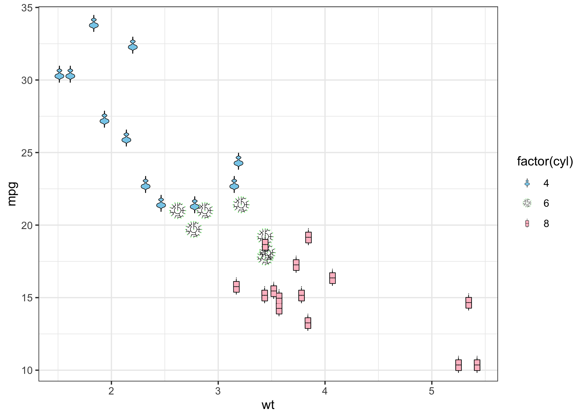

<!-- README.md is generated from README.Rmd. Please edit that file -->

# ggfoundry <a href="https://cgoo4.github.io/ggfoundry/"></a>

<!-- badges: start -->

[](https://lifecycle.r-lib.org/articles/stages.html#experimental)
[](https://app.codecov.io/gh/cgoo4/ggfoundry?branch=main)
[](https://github.com/cgoo4/ggfoundry/actions/workflows/R-CMD-check.yaml)
[](https://CRAN.R-project.org/package=ggfoundry)
<!-- badges: end -->

Arbitrary hand-crafted fillable shapes for ggplot2.

New shapes may be feature requested via a Github issue.

## Installation

``` r
install.packages("ggfoundry")
```

## Development version

To get a bug fix, or to use a feature from the development version, you
can install ggfoundry from GitHub.

``` r
# install.packages("devtools")
devtools::install_github("cgoo4/ggfoundry")
```

## Basic example

See [get
started](https://cgoo4.github.io/ggfoundry/articles/ggfoundry.html) for
more details.

``` r
library(ggfoundry)
#> Loading required package: ggplot2
```

``` r

ggplot(mtcars, aes(wt, mpg, fill = factor(cyl))) +
  geom_casting(aes(shape = factor(cyl))) +
  scale_fill_manual(values = c("skyblue", "lightgreen", "pink")) +
  scale_shape_manual(values = c("violin", "dendro", "box")) +
  theme_bw()
```


