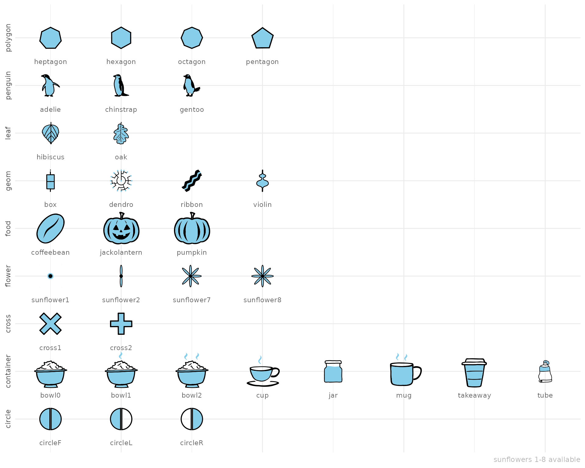
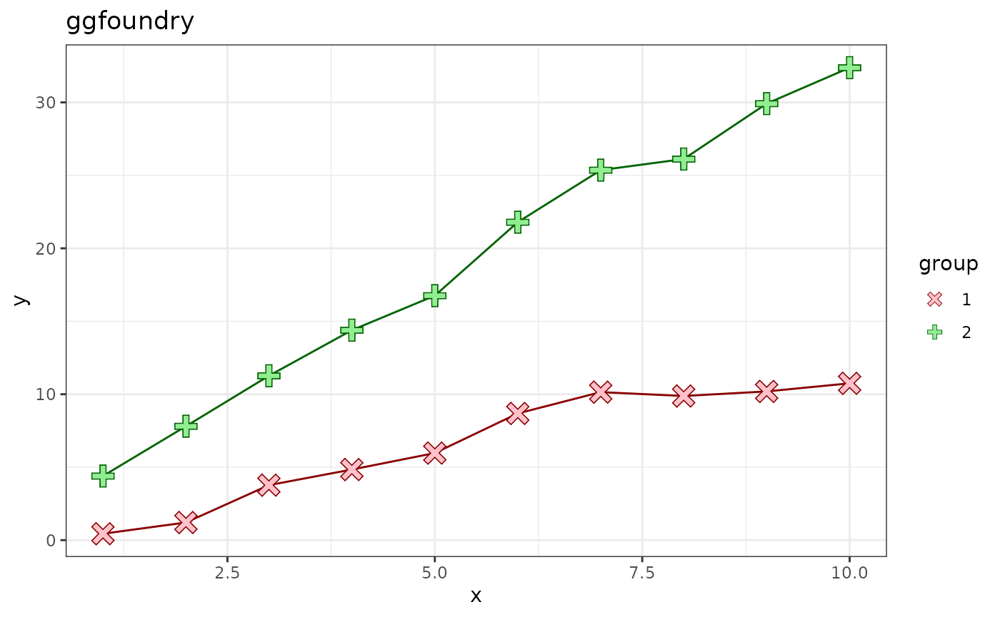
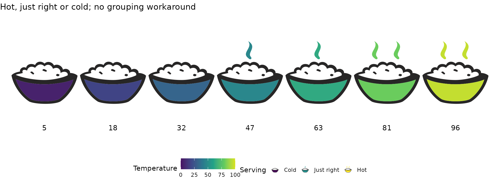
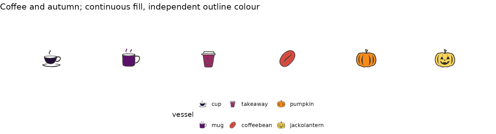

# ggfoundry

## Motivation

ggfoundry was inspired a little by Stack Overflow posts seeking specific
shapes. But, in truth, mostly by a personal interest in getting
acquainted with grid graphics (the underpinnings of ggplot2).

## Shape landscape

Yes, there is already a seemingly near-infinite number of shapes out
there:

- Those familiar to ggplot users (some fillable) as described in the
  [ggplot2
  documentation](https://ggplot2.tidyverse.org/articles/ggplot2-specs.html#point);
- Colourable [unicodes](https://www.compart.com/en/unicode/category/So)
  and [icons](https://fontawesome.com/icons/) like fontawesome;
- [ggimage](https://github.com/GuangchuangYu/ggimage) enables the use of
  whole pictures;
- And then there is the DIY (Do-It-Yourself) approach: Conjuring up
  grobs (grid graphical objects); perhaps with a sprinkle of
  trigonometry.

But sometimes you just can’t find what you want. Nor manipulate it in
the way you would like.

ggfoundry offers arbitrary hand-crafted colourable and fillable shapes
for ggplot2 and is reviewed side-by-side with other options in [contrast
with alternatives](https://cgoo4.github.io/ggfoundry/articles/contrast).

## Foundry process

These artisanal symbols begin life as vector images with two layers: an
outline and a fill. Some are hand-drawn; others, such as the “bowl” set,
are constructed programmatically. Each SVG pair is converted to Cairo
graphics format, forged at extreme temperatures into objects of class
“Picture”, and finally delicately cast as a `gTree` representation of
the original shape. But not quite back to where we started, because they
are now editable.

When cooled and finely burnished, the `gTree` and all its grob children
may then be manipulated by
[`geom_casting()`](https://cgoo4.github.io/ggfoundry/reference/geom_casting.md)
to render the desired ggplot with those special high-end adornments.

## Available shapes

ggfoundry may well be the destination of “last resort”!

After travelling the mountains, seas and forests of the world in search
of that elusive shape (or small set), a hand-made grob may be the
fillable “Holy Grail” sought via a [Github
issue](https://github.com/cgoo4/ggfoundry/issues).

These sets are included with the latest version of the package. You can
“mix and match” shapes from different sets; the “set” is for grouping
shapes in the documentation and for use in
[`shapes_cast()`](https://cgoo4.github.io/ggfoundry/reference/shapes_cast.md)
to filter for the desired shapes.

``` r

library(ggfoundry)
library(dplyr)
library(forcats)
library(stringr)

df <- shapes_cast() |> 
  filter(!str_ends(shape, "3|4|5|6")) |> 
  mutate(x = row_number(), shape = fct_inorder(shape), .by = set)

df |> 
  ggplot(aes(x, set)) +
  geom_text(aes(label = shape), nudge_y = -0.5, colour = "grey40", size = 3) +
  geom_casting(aes(shape = shape), size = 0.11, fill = "skyblue") +
  scale_shape_manual(values = as.character(df$shape)) +
  scale_x_continuous(expand = expansion(add = 0.5)) +
  scale_y_discrete(expand = expansion(add = 0.7)) +
  labs(x = NULL, y = NULL, caption = "sunflowers 1-8 available") +
  theme_minimal() +
  theme(
    text = element_text(colour = "grey70"),
    axis.text.y = element_text(angle = 90, hjust = 0.5),
    axis.text.x = element_blank(),
    axis.ticks.x = element_blank(),
    legend.position = "none"
    )
```



## Simple example

Using some made-up data simulating a “random walk”,
[`geom_casting()`](https://cgoo4.github.io/ggfoundry/reference/geom_casting.md)
adds a layer of custom shapes to the plot.

When the shape is mapped to a variable, then
[`scale_shape_manual()`](https://ggplot2.tidyverse.org/reference/scale_manual.html)
is required to explicitly name the desired shapes as a character vector.
This is because standard shapes (as used for example in
[`geom_point()`](https://ggplot2.tidyverse.org/reference/geom_point.html))
are associated with a number, e.g. a circle is 19, whereas
[`geom_casting()`](https://cgoo4.github.io/ggfoundry/reference/geom_casting.md)
shapes are associated only with character strings.

Each shape’s appearance is resolved observation by observation, so
aesthetics such as `colour`, `fill`, `alpha`, `size` and `angle` may
vary continuously across the data, whether grouping is implicit or
explicitly shared with `group = 1`.

Using
[`scale_colour_manual()`](https://ggplot2.tidyverse.org/reference/scale_manual.html)
and
[`scale_fill_manual()`](https://ggplot2.tidyverse.org/reference/scale_manual.html),
we can also select a custom palette for the shape colours and fills.

``` r

# Toy Data
set.seed(123)

random_walk <- \(x, y, z) cumsum(rnorm(x, mean = y, sd = sqrt(z)))

df <- data.frame(
  x = rep(1:10, 2),
  y = c(
    random_walk(10, 1, 1),
    random_walk(10, 3, 1.3)
  ),
  group = factor(c(rep(1, 10), rep(2, 10)))
)

# Plot with geom_casting()
df |>
  ggplot(aes(x, y, shape = group, colour = group, fill = group)) +
  geom_line(show.legend = FALSE) +
  geom_casting() +
  scale_colour_manual(values = c("darkred", "darkgreen")) +
  scale_fill_manual(values = c("pink", "lightgreen")) +
  scale_shape_manual(values = c("cross1", "cross2")) +
  labs(title = "ggfoundry") +
  theme_bw() +
  theme(plot.subtitle = element_text(size = 10))
```



## Porridge bowls

The “bowl” set brings three containers to the table: `bowl0`, `bowl1`
and `bowl2`, distinguished only by zero, one or two wisps of steam
rising from the porridge. The bowl body and the steam share the `fill`,
while the bowl and porridge outline take the `colour`. All three
variants share the same canvas and bowl position, so they may be swapped
freely with
[`scale_shape_manual()`](https://ggplot2.tidyverse.org/reference/scale_manual.html).

A continuous `fill` maps directly to any numeric variable, with no
grouping workaround required. And a `fill` of `"transparent"` hides the
steam while the bowl outline remains visible.

``` r

bowls <- data.frame(
  x = 1:7,
  temperature = c(5, 18, 32, 47, 63, 81, 96)
)

bowls |>
  ggplot(
    aes(
      x, 1, fill = temperature,
      shape = cut(temperature, 3, labels = c("Cold", "Just right", "Hot"))
    )
  ) +
  geom_casting(colour = "#272626", size = 0.72) +
  geom_text(aes(y = 0.35, label = temperature), size = 4) +
  scale_shape_manual(
    values = c("bowl0", "bowl1", "bowl2"),
    guide = guide_legend(
      override.aes = list(fill = c("#240691", "#C8437B", "#F8DF25")),
      keyheight = unit(2.5, "lines"), default.unit = "line"
    )
  ) +
  scale_fill_viridis_c(
    limits = c(0, 100), begin = 0.04, end = 0.94, option = "plasma",
    guide = "none"
  ) +
  scale_x_continuous(limits = c(0.35, 7.65), expand = expansion(mult = 0)) +
  scale_y_continuous(limits = c(0, 1.85), expand = expansion(mult = 0)) +
  labs(title = "Hot, just right or cold", shape = "Serving") +
  theme_void() +
  theme(legend.position = "bottom")
```



See the
[showcase](https://cgoo4.github.io/ggfoundry/articles/example_uses)
article to explore other use cases and [contrast with
alternatives](https://cgoo4.github.io/ggfoundry/articles/contrast) to
review against other options.

## Coffee and autumn

Six newcomers arrive with a new “food” set: a `cup`, a `mug` and a
`takeaway` cup join the “container” set, while a `coffeebean`, a
`pumpkin` and a `jackolantern` found the “food” set. As with the bowls,
`cup` and `mug` steam shares the `fill`, so a transparent `fill` hides
the steam while the outline remains; the `takeaway` sleeve follows the
`fill`, and the ribs, bean crease, stems and carved faces follow the
`colour`. They are different vessels, not an ordinal temperature
classification.

``` r

cafe <- data.frame(
  x = 1:6,
  roast = c(8, 24, 42, 60, 78, 95),
  vessel = c("cup", "mug", "takeaway", "coffeebean", "pumpkin", "jackolantern")
)

cafe |>
  ggplot(aes(x, 1, fill = roast, shape = vessel)) +
  geom_casting(colour = "#33302D", size = 0.34) +
  scale_shape_manual(
    values = setNames(cafe$vessel, cafe$vessel),
    breaks = cafe$vessel,
    guide = guide_legend(
      override.aes = list(
        fill = c("#1B0C42", "#59106E", "#9B2964", "#D74B3F", "#F88A0C", "#F7D441")
      ),
      nrow = 2, keyheight = unit(2, "lines"), default.unit = "line"
    )
  ) +
  scale_fill_viridis_c(
    limits = c(0, 100), begin = 0.04, end = 0.94, option = "inferno",
    guide = "none"
  ) +
  scale_x_continuous(limits = c(0.35, 6.65), expand = expansion(mult = 0)) +
  scale_y_continuous(limits = c(0.55, 1.65), expand = expansion(mult = 0)) +
  labs(title = "Coffee and autumn; continuous fill, independent outline colour") +
  theme_void() +
  theme(legend.position = "bottom")
```



## Acknowledgements

Without the pivotal grConvert (Potter 2024) and grImport2 (Potter and
Murrell 2023) packages, the foundry process would not have been viable.
And only thanks to the work behind ggplot2 (Wickham 2016), may the
shapes cast be so beautifully visualised.

Potter, Simon. 2024. *grConvert: Converting Vector Graphics*.
<https://github.com/sjp/grConvert>.

Potter, Simon, and Paul Murrell. 2023. *grImport2: Importing ’SVG’
Graphics*. <https://CRAN.R-project.org/package=grImport2>.

Wickham, Hadley. 2016. *Ggplot2: Elegant Graphics for Data Analysis*.
<https://ggplot2.tidyverse.org>.
